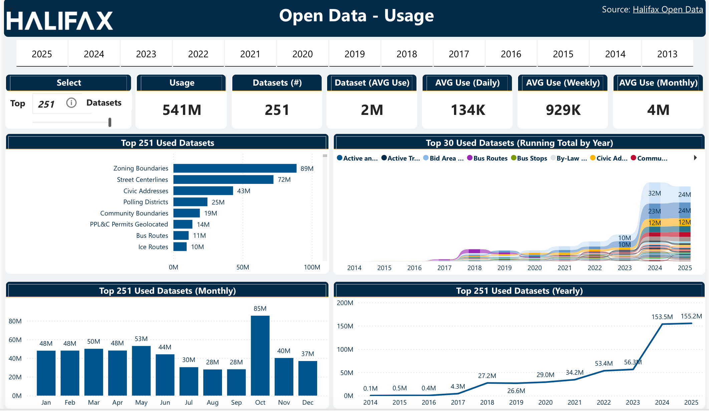
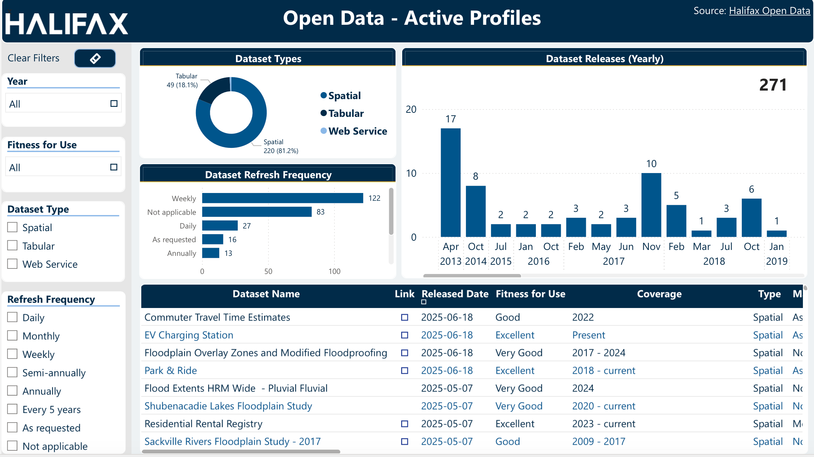

# Open Data Dashboard

Business Intelligence dashboard project focused on analyzing and visualizing municipal open data profiles and dataset activity.

---

## Project Overview

This dashboard was designed to support open data accessibility and operational insights through interactive visualizations and reporting.

The dashboard provides a centralized view of:
- Dataset types
- Dataset release activity
- Refresh frequency
- Dataset quality and fitness for use
- Coverage periods
- Open data availability trends

The project supports data-driven decision-making and transparency initiatives within a municipal government environment.

---

## Data Source

https://catalogue-hrm.opendata.arcgis.com/datasets/e2485b695f7d44508e9ba991ac073439_0/explore

---

## Dashboard Features

### Interactive Filters
- Year
- Dataset Type
- Refresh Frequency
- Fitness for Use

### Visualizations
- Dataset type distribution
- Annual dataset releases
- Refresh frequency analysis
- Dataset inventory tables

### Reporting Objectives
- Improve visibility into open data resources
- Support operational analytics
- Enhance data accessibility and transparency
- Monitor dataset quality and maintenance trends

---

## Tools & Technologies

- Power BI
- SQL
- Data Visualization
- Open Data Analytics
- Dashboard Reporting

---

## Skills Demonstrated

- Business Intelligence Reporting
- Dashboard Design
- Data Analysis
- Data Visualization
- Public Sector Analytics
- Operational Reporting
- User-focused Reporting Design

---

## Dashboard Preview

---

## Disclaimer

This repository contains generalized project descriptions and screenshots for portfolio purposes only. No confidential or sensitive data is included.
